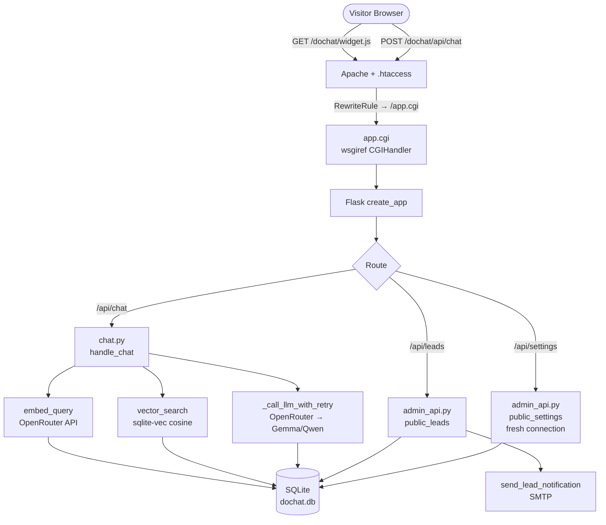
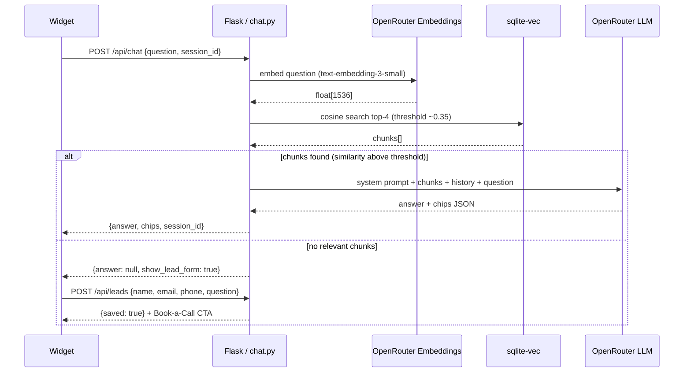
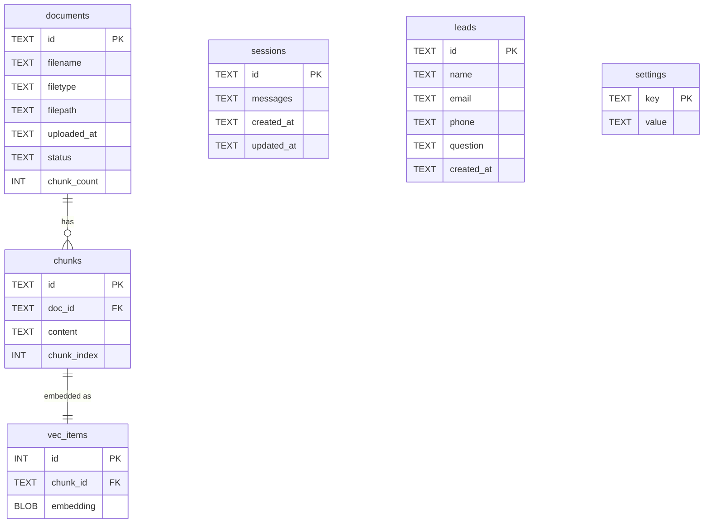

# DocChat — Embeddable RAG Chatbot for Shared Hosting

[](LICENSE)
[](https://www.python.org/downloads/)
[](#test-suite)

A production-ready Retrieval-Augmented Generation (RAG) chatbot engineered to run inside the hard constraints of SiteGround shared hosting: **sub-20ms vector search (sqlite-vec) within a ~256 MB per-process RAM budget, on Apache CGI where every request is a cold start**. Visitors ask questions; the system answers from a curated document library managed by the site admin. Embeds on any website with a single `<script>` tag.

**Live deployment:** social-automate.com  
**Stack:** Python · Flask · SQLite + sqlite-vec · OpenRouter API or local Ollama · Vanilla JS (Shadow DOM)

---

## What It Does

- Admin uploads PDF, DOCX, TXT, or a URL → system parses, chunks, embeds, and indexes it
- Visitor opens the chat widget, asks a question → system retrieves relevant document chunks, sends them to an LLM, returns a grounded answer
- If no document chunk is similar enough (cosine similarity below threshold), the widget shows an inline lead capture form instead of hallucinating
- Captured leads (name, email, phone, question) are stored in SQLite and emailed to admin via SMTP
- Admin reviews documents and leads through a password-protected web UI

---

## Why This RAG Is Different

Most RAG tutorials assume you control your infrastructure — a VPS, a cloud VM, Docker, a persistent process. This project was built for **SiteGround cPanel shared hosting**, which has hard limits that invalidate the standard stack at every layer:

| Layer | Standard RAG | This project |
|---|---|---|
| **Process model** | Gunicorn / uvicorn (persistent) | Apache CGI (`wsgiref.handlers.CGIHandler`) — fresh Python process per request |
| **Web framework** | FastAPI (ASGI) | Flask (WSGI) — CGI only supports WSGI |
| **Vector store** | ChromaDB / FAISS / Pinecone | `sqlite-vec` — native SQLite extension, single `.db` file |
| **Embeddings** | `sentence-transformers`, PyTorch | OpenRouter API (or local Ollama over HTTP) — PyTorch would OOM-kill the CGI process |
| **State** | In-memory caches, background workers | All state in SQLite; WAL mode for cross-process read safety |
| **RAM budget** | Unconstrained | ~256 MB per CGI process; zero tolerance for memory spikes |
| **Data storage** | S3, filesystem, object store | `~/dochat/storage/` (outside `public_html/`, not web-accessible) |

The result is a system that genuinely works on the cheapest tier of shared hosting, requires zero DevOps, and deploys with a `git pull` + `touch app.cgi`.

---

## Architecture

### Request Flow



### Admin + Ingest Flow

```mermaid
flowchart TD
    Admin([Admin Browser]) -->|GET/POST /dochat/admin/*| B[Apache + .htaccess]
    B -->|@require_auth| C[Flask admin routes]

    C -->|POST /ingest/upload| D[ingest_file]
    C -->|POST /ingest/url| E[ingest_url]
    D & E --> F[parser.py\nPDF/DOCX/TXT/URL]
    F --> G[chunker.py\nRecursiveCharacterTextSplitter\n511 tokens / 100 overlap]
    G --> H[embedder.py\nOpenRouter text-embedding-3-small]
    H --> I[(SQLite\ndocuments + chunks\n+ vec_items)]
    H --> J[~/dochat/storage/\noriginal files on disk]

    C -->|GET /admin/leads| K[admin.py\nfresh sqlite3 connection]
    C -->|POST /admin/settings| L[admin_api.py\nINSERT OR REPLACE settings]
    C -->|POST /admin/docs/id/delete| M[_delete_document\nDB + file + vectors]
```

### Query Pipeline (Detail)



### Database Schema



---

## Constraints, Trade-offs, and Gotchas

### The CGI Process Model

Every HTTP request spawns a fresh `python3` process. That means:

**Pros:**
- No shared state between requests — no race conditions, no thread-safety concerns
- Memory freed on every request — no long-running leaks
- Simple to reason about — one request, one process, done

**Cons:**
- No in-process caching — every request pays cold-start cost
- SQLite WAL stale-read problem: if one process writes and another opens the same connection object (e.g. a Passenger persistent worker), the second process may read a cached page. **Fix:** open a fresh `sqlite3.connect()` for all reads that need current data, never reuse the global `DB_CONN` for cross-process-visible writes
- `os.path.expanduser('~')` resolves differently inside Passenger/CGI vs. SSH — `~` maps to a different directory. **Fix:** derive all paths from `__file__` using `os.path.abspath`

### sqlite-vec vs. ChromaDB

| | sqlite-vec | ChromaDB |
|---|---|---|
| RAM at idle | ~0 MB extra | 400+ MB (HNSW index loads entirely into memory) |
| Setup | Zero — bundled as a `.so` extension | `pip install chromadb` pulls 15+ transitive deps |
| Persistence | Single `.db` file, WAL mode | Separate `chroma.sqlite3` + parquet segment files |
| Query speed | ~5–20ms for small-medium collections | Faster at 10M+ vectors (HNSW is O(log n)) |
| Shared-hosting safe | Yes | No — OOM-killed immediately |

For collections under ~100K vectors (typical for a business document library), sqlite-vec query latency is negligible. The RAM constraint makes ChromaDB a non-starter.

### OpenRouter vs. Local Embeddings

Sentence-transformers + PyTorch would require ~800 MB RAM just to load the model — 3× the per-process budget. OpenRouter's `text-embedding-3-small` API:
- Costs ~$0.02 per 1M tokens (essentially free at small scale)
- Returns `float[1536]` vectors compatible with OpenAI's embedding space
- Adds ~200ms round-trip but no RAM cost at all

Trade-off: embedding now depends on an external API. If OpenRouter is down, ingest and query both fail. Mitigation: the lead-capture fallback still fires on any query error, so visitors always have a way to reach the business.

### SiteGround Blocks HTTP DELETE

SiteGround's Apache configuration rejects non-standard HTTP methods (DELETE, PUT, PATCH) at the server level — Flask never sees them. All document deletion goes through `POST /dochat/admin/docs/<id>/delete` with a matching `.htaccess` RewriteRule.

### LangChain Chunker Off-by-One

`RecursiveCharacterTextSplitter.from_tiktoken_encoder` with `chunk_size=512` produces 513-token chunks. The embedding model's context window is 512. Use `chunk_size=511` to stay within bounds.

### The `admin.js` Static File Problem

`url_for('static', filename='admin.js')` generates `/static/admin.js`, which Apache serves directly from `public_html/static/`. There is no such file — only `~/dochat/static/admin.js` exists. Without a CGI route, the file 404s silently and no JS handlers attach. Fix: expose `/dochat/admin.js` as an explicit Flask route that serves the file from the repo's `static/` directory.

---

## Features

**Document management**
- Upload PDF, DOCX, TXT/MD files (up to 10 MB)
- Submit URLs for automatic web crawling via trafilatura
- Atomic ingestion: parse → chunk → embed → index in a single transaction; rollback on any failure
- Delete documents with full cleanup (file, DB row, all vector embeddings)

**Query pipeline**
- Embed visitor question → cosine search → top-4 chunks → LLM with context window
- Multi-turn conversation: last 10 turns carried in LLM context
- Similarity threshold gating: questions with no good match trigger lead form, not hallucination
- Automatic LLM failover (primary → fallback on 429/error)
- Follow-up chip suggestions (visitor-perspective, generated alongside each answer)

**Lead capture**
- Inline lead form (no redirect, no page reload) on similarity fallback
- Fields: name, email, phone (optional), question captured automatically
- SMTP email notification to admin (non-fatal: lead is saved even if email fails)
- "Book a Call" CTA button with configurable URL (admin Settings page)

**Widget**
- Shadow DOM isolation — zero CSS bleed from host page
- Theming via `window.DocChatConfig` (color, logo, title, font)
- Mobile-responsive with `svh` units for iOS Safari compatibility
- Animated: spring panel open/close, directional message slide-in, bouncing typing dots
- Accessible: ARIA roles, 44px touch targets, keyboard navigation, reduced-motion support
- URLs in bot responses are auto-linkified (XSS-safe, opens in new tab)

**Admin UI**
- Password-protected (HTTP Basic Auth via `.env`)
- Document list with status, chunk count, upload date
- Leads table with name, email, phone, question, timestamp
- Settings page for Book-a-Call URL
- `Cache-Control: no-store` on all admin routes (prevents LiteSpeed cache staleness)

---

## Project Structure

```
.
├── app/
│   ├── __init__.py          # Flask factory (create_app), widget.js + admin.js routes
│   ├── auth.py              # @require_auth decorator (HTTP Basic)
│   ├── db.py                # _open_db(), init_* functions, sqlite-vec loader
│   ├── ingest/
│   │   ├── parser.py        # PDF/DOCX/TXT/URL extraction
│   │   ├── chunker.py       # RecursiveCharacterTextSplitter (tiktoken, 511 tokens)
│   │   └── embedder.py      # OpenRouter embeddings API, batch retry
│   ├── routes/
│   │   ├── admin.py         # GET /dochat/admin/* (password-protected pages)
│   │   ├── admin_api.py     # POST admin API + public /api/leads + /api/settings
│   │   ├── chat.py          # POST /dochat/api/chat (CORS, session, RAG dispatch)
│   │   ├── health.py        # GET /dochat/health
│   │   └── ingest.py        # Direct ingest routes
│   ├── services/
│   │   ├── ingestion.py     # ingest_file(), ingest_url(), _delete_document()
│   │   ├── query.py         # handle_chat() — full RAG pipeline
│   │   └── email.py         # send_lead_notification() via SMTP
│   └── static/
│       ├── widget.js        # Embeddable Shadow DOM widget (~800 lines, zero deps)
│       └── admin.js         # Admin UI JS (document CRUD, settings save) — not served
│                             # via /static/; routed explicitly by Flask to bypass Apache
├── static/
│   └── admin.js             # Symlinked / duplicated — served at /dochat/admin.js
├── templates/
│   └── admin/               # Jinja2 templates (base, docs, leads, settings)
├── tests/                   # 107 pytest tests across 11 files
├── scripts/
│   ├── archive_sessions.py  # Standalone cron script for session archival
│   └── test_email.py        # SMTP connectivity test (run manually: python3 scripts/test_email.py)
├── app.cgi                  # Apache CGI entry point (wsgiref.handlers.CGIHandler)
├── passenger_wsgi.py        # Passenger shim (fallback — not used on SiteGround)
├── staging_htaccess_patch.txt         # .htaccess rules — base routes
├── staging_widget_htaccess_patch.txt  # .htaccess rules — widget delivery
├── staging_htaccess_patch_phase6.txt  # .htaccess rules — lead capture + admin.js
├── requirements.txt
└── .env.example
```

---

## Local Development

```bash
# 1. Clone and set up venv
git clone <repo>
cd dochat
python3 -m venv venv
source venv/bin/activate
pip install -r requirements.txt

# 2. Configure environment
cp .env.example .env
# Edit .env — set OPENROUTER_API_KEY, ADMIN_PASSWORD, SECRET_KEY, SMTP_* vars

# 3. Run locally (Flask dev server)
export FLASK_APP=app
export FLASK_ENV=development
flask run

# 4. Run tests (never run automatically — always use this command)
pytest -v
```

The app uses `STORAGE_PATH` from `.env` (or `./storage/` by default) for the SQLite DB and uploaded files. The dev server will create `storage/dochat.db` on first request to `/dochat/health`.

### Run fully local with Ollama (no API key)

DocChat talks to any OpenAI-compatible endpoint, so you can run it entirely offline against a local [Ollama](https://ollama.com) server. This is ideal for development and testing. Ollama runs as a separate process reached over HTTP, so this does not add `torch`/`transformers` to the app and keeps the shared-hosting RAM budget intact.

```bash
ollama pull llama3              # chat model (or gemma4:e4b, mistral, ...)
ollama pull nomic-embed-text    # embeddings (768-dim)

# In .env:
LLM_PROVIDER=ollama             # flips both chat and embeddings to local
PRIMARY_MODEL=llama3
# embeddings default to nomic-embed-text (768 dims) automatically
```

Switch back to production by setting `LLM_PROVIDER=openrouter` and an `OPENROUTER_API_KEY`. The embedding dimension differs between providers (1536 for OpenRouter, 768 for Ollama), so re-ingest your documents after switching.

---

## SiteGround Deployment

```bash
# On the server (SSH)
cd ~/dochat
git pull origin master
source venv/bin/activate
pip install -r requirements.txt
touch app.cgi   # signals Passenger/Apache to reload the app
```

**cPanel Python Selector settings:**
- Python version: 3.10+
- Application root: `~/dochat`
- Application URL: `/dochat`
- Application startup file: `app.cgi`

Apply all three `.htaccess` patch files in order. The complete routing table after applying all patches:

| Pattern | Destination |
|---|---|
| `^dochat/api/chat` | `/app.cgi/dochat/api/chat` |
| `^dochat/widget\.js` | `/app.cgi/dochat/widget.js` |
| `^dochat/admin\.js` | `/app.cgi/dochat/admin.js` |
| `^dochat/api/leads` | `/app.cgi/dochat/api/leads` |
| `^dochat/api/settings` | `/app.cgi/dochat/api/settings` |
| `^dochat/admin/settings` | `/app.cgi/dochat/admin/settings` |
| `^dochat/admin/docs/([^/]+)/delete` | `/app.cgi/dochat/admin/docs/$1/delete` |
| `^dochat/.*` | `/app.cgi/dochat/$0` |

Key SiteGround-specific notes:
- The home directory resolves as `/home/customer/` (symlink) — all shebangs use this path
- No Passenger, no mod_wsgi — Apache CGI only via `wsgiref.handlers.CGIHandler`
- `enable_load_extension` is available — sqlite-vec runs in native mode (not Python fallback)
- `STORAGE_PATH` is derived from `__file__` in `create_app()`, not `HOME` — Passenger/CGI resolves the home directory differently from SSH
- SiteGround blocks HTTP DELETE at the Apache layer — use `POST .../delete` instead

---

## Environment Variables

```env
SECRET_KEY=<random string>
ADMIN_PASSWORD=<password for /dochat/admin>

OPENROUTER_API_KEY=<your key>
PRIMARY_MODEL=google/gemma-3-27b-it:free
FALLBACK_MODEL=qwen/qwen3-next-80b-a3b-instruct:free
EMBEDDING_MODEL=text-embedding-3-small

STORAGE_PATH=~/dochat/storage       # absolute path to DB + uploads dir
ALLOWED_ORIGINS=https://your-site.com,https://www.your-site.com

# SMTP (for lead notifications — optional, non-fatal if unset)
SMTP_HOST=smtp.gmail.com
SMTP_PORT=587
SMTP_USER=you@gmail.com
SMTP_PASS=<app password>
ADMIN_EMAIL=you@yourdomain.com

# Session archival (optional)
MYSQL_HOST=...
MYSQL_DB=...
MYSQL_USER=...
MYSQL_PASS=...
```

---

## Embedding Widget

```html
<!-- Minimal embed -->
<script>
  window.DocChatConfig = {
    apiUrl: 'https://your-site.com/dochat/api/chat',
  };
</script>
<script src="https://your-site.com/dochat/widget.js"></script>

<!-- Full config -->
<script>
  window.DocChatConfig = {
    apiUrl:       'https://your-site.com/dochat/api/chat',
    leadsUrl:     'https://your-site.com/dochat/api/leads',
    settingsUrl:  'https://your-site.com/dochat/api/settings',
    primaryColor: '#3b82f6',
    title:        'Ask us anything',
    logoUrl:      'https://your-site.com/logo.png',
    fontFamily:   'Inter, sans-serif',
    placeholder:  'Type your question…',
  };
</script>
<script src="https://your-site.com/dochat/widget.js"></script>
```

---

## Test Suite

```bash
pytest -v                              # all 107 tests
pytest tests/test_chat.py -v           # RAG pipeline + LLM failover
pytest tests/test_leads.py -v          # lead capture (16 tests)
pytest tests/test_ingest_upload.py -v  # file ingestion
pytest tests/test_widget_delivery.py -v
```

Tests use `pytest-mock` to stub OpenRouter API calls and SMTP — no external services needed. The DB is an in-memory SQLite instance initialized fresh per test via `conftest.py`.

---

## Key Design Decisions

| Decision | Rationale |
|---|---|
| Flask over FastAPI | FastAPI is ASGI; Apache CGI is WSGI-only |
| sqlite-vec over ChromaDB/Pinecone | No external service, no RAM spike; single `.db` file |
| OpenRouter API for embeddings | `sentence-transformers` / PyTorch would OOM-kill the CGI process |
| CGI over Passenger WSGI | SiteGround shared hosting has neither Passenger nor mod_wsgi |
| WAL mode + checkpoint after writes | CGI = separate processes per request; WAL ensures cross-process reads see fresh data |
| Fresh `sqlite3.connect()` for reads | Reusing the global connection object in Passenger reads from a page cache pinned at startup |
| `chunk_size=511` not 512 | LangChain off-by-one produces 513-token chunks at exactly 512 |
| Manual `BEGIN/COMMIT/ROLLBACK` | `with conn:` uses SQLite's implicit transaction semantics, which conflict with this setup |
| Shadow DOM for widget | Complete CSS isolation from host site; no build step; one `<script>` tag |
| Data outside `public_html/` | `~/dochat/storage/` is not web-accessible; prevents direct file download |
| `POST .../delete` not `DELETE` | SiteGround's Apache blocks HTTP DELETE method at the server layer |
| `Cache-Control: no-store` on admin | SiteGround LiteSpeed cache would otherwise serve stale admin HTML |
| Path from `__file__`, not `~` | `os.path.expanduser('~')` resolves differently in CGI vs SSH on SiteGround |

---

## License

MIT — see [LICENSE](LICENSE).
